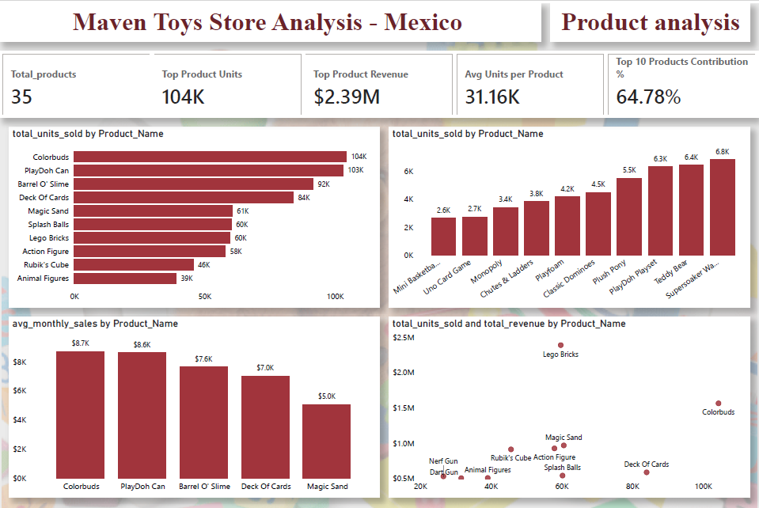

# Mexico Store Analysis

## Project Summary

The project is structured into three main analytical areas: Sales Analysis, Product Analysis, and Demand Analysis.
The Sales Analysis provides a high-level view of business performance by tracking total units sold, revenue trends, average monthly sales, and month-over-month growth. This analysis helps identify periods of strong and weak performance and highlights how sales fluctuate across months and years.

The Product Analysis focuses on understanding how individual products and categories contribute to overall sales. It identifies top-selling and low-performing products, evaluates average product performance, and measures dependency on a small group of high-performing products. This analysis reveals that a limited number of products drive a significant share of total sales, while many products contribute relatively little, highlighting opportunities for product portfolio optimization.

The Demand Analysis examines seasonal patterns and demand behavior over time. By analyzing monthly sales trends and category-level demand, the project identifies clear seasonality in toy sales, with peak demand occurring during specific months. This analysis helps understand how customer demand changes throughout the year and supports better demand forecasting and planning.

[Click here to view Live Dashboard](https://app.powerbi.com/reportEmbed?reportId=1a860e17-734c-4f61-9303-3667ba84567b&autoAuth=true&ctid=3ffff7b6-7ef4-4fa4-8fea-798ab0455714)

## About the company:
Maven Toys is a fictitious retail toy store chain operating across multiple cities in Mexico. The company sells a wide range of toy products across categories such as Art & Crafts, Toys, Games, Sports & Outdoors, and Electronics. The dataset captures daily sales transactions, product details, and calendar information, enabling detailed analysis of sales performance, product contribution, and demand patterns.

## Client requirement and objective: 
The management team at Maven Toys requested a comprehensive analysis of store sales data to better understand overall business performance, identify top-performing products, and uncover demand patterns across time and product categories. The objective of the analysis was to support data-driven decisions related to sales strategy, product focus, and demand planning.

## Primary Goals of the Analysis:
-	Analyse overall sales performance and trends over time
-	Identify top and low-performing products and measure product dependency
-	Understand seasonal demand patterns and monthly demand fluctuations
-	Provide actionable insights to support sales planning and product strategy

## Datasets used for the Project: 
This project is based on Maven Toys retail data covering multiple years of sales activity in Mexico. The analysis uses the following datasets:
-	Sales : Contains transaction-level sales data, including date, product ID, store ID, and units sold.
-	Products: Includes product details such as product name, product category, and selling price.
-	Calendar : Provides date-related attributes such as month, year, and month-year for time-based analysis.
These datasets together form the foundation for sales trend analysis, product performance evaluation, and demand seasonality assessment.

## Tools and Technique Used:

### Tools
Microsoft Excel
-	Used for initial data exploration and validation
-	Performed basic data checks before loading into Power BI
Power BI
-	Built interactive dashboards with dynamic filtering
-	Created calculated measures using DAX
-	Designed visually consistent and business-focused reports

### Techniques
-	Data Preparation: Cleaning and structuring raw data for analysis
-	Data Modelling: Establishing relationships between sales, products, and calendar tables
-	DAX Measures: Creating KPIs such as revenue, growth rate, and seasonal concentration
-	Data Visualization: Using charts, heatmaps, and KPIs to communicate insights clearly

## Sales Analysis:
The Sales Analysis dashboard provides a high-level view of overall business performance. It focuses on total sales volume, revenue generation, and sales growth over time. Monthly and yearly trends are analysed to identify periods of strong and weak performance.

### Key Insights
-	Sales volume and revenue show clear monthly variation.
Sales peak during mid-year months, indicating stronger customer activity during this period, while a noticeable decline occurs toward the end of the year.
-	Product categories contribute unevenly to total sales.
Art & Crafts and Toys emerge as the leading categories, accounting for a significant share of total units sold.
-	Revenue trends align closely with sales volume trends.
Months with higher unit sales also generate higher revenue, confirming stable pricing and consistent product mix.
-	Positive month-over-month growth is observed overall.
Despite fluctuations, the business maintains a positive growth trajectory across the analysed period.

## Product Analysis:
The Product Analysis dashboard focuses on understanding how individual products contribute to total sales and revenue. It identifies top-selling products, evaluates average product performance, and measures dependency on a limited set of products.

### Key Insights
-	Sales are highly concentrated among a small number of products.
The top 10 products account for nearly two-thirds of total sales, highlighting a strong reliance on key products.
-	Top-selling products differ from top-revenue products.
Some products generate high sales volume but relatively lower revenue, while others generate higher revenue with fewer units sold.
-	Several products show consistently low performance.
A group of products contributes minimally to overall sales, indicating potential opportunities for product rationalization or promotional strategies.
-	Average units sold per product reveal performance imbalance.
While a few products perform exceptionally well, many products sell at a much slower rate.

## Demand Analysis:
The Demand Analysis dashboard examines sales behaviour across time to identify seasonality and demand patterns. Monthly trends and category-level demand fluctuations are analysed to understand how customer demand changes throughout the year.

### Key Insights
- Demand is clearly seasonal.
Peak demand occurs between April and July, while October and November record the lowest sales volumes.
- Seasonality varies by product category.
Toys and Art & Crafts drive most of the seasonal spikes, while other categories remain relatively stable.
- A significant portion of annual sales is concentrated in a few months.
Over 30% of total sales occur during the top demand months, increasing dependency on seasonal performance.
- Monthly average sales smooth daily volatility.
Average monthly sales provide a clearer view of underlying demand trends, supporting better demand forecasting.

## Conclusion
The Maven Toys sales and demand analysis provides valuable insights into overall business performance, product contribution, and seasonal demand behaviour. The analysis highlights strong reliance on a limited set of products and clear seasonality in customer demand. While overall sales performance is positive, the findings suggest opportunities to diversify product contribution and better plan for seasonal demand fluctuations. By leveraging these insights, Maven Toys can improve sales planning, product strategy, and long-term business performance.
 

